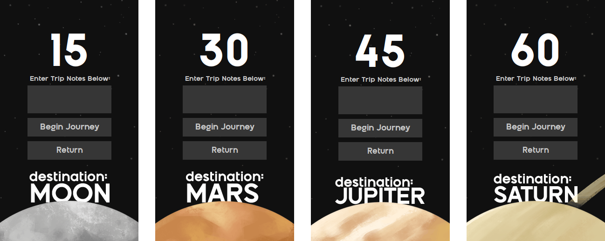

# Parsec - An Interactive Study Tool

### Purpose
**What will Parsec do?** Parsec is a focus tool for those who wish to give their mundane work sessions a splash of colour. 
The central theme is space exploration, as the user sets timers to work or study, virtual astronauts can be sent to various colonies in our solar system. 
This creates a sense of progression over time and makes the user's everyday life just a little more interesting.

**Time required for each colony:**
- it will take 15 minutes to reach the Moon
- it will take 30 minutes to reach Mars
- it will take 45 minutes to reach Jupiter
- it will take 60 minutes to reach Saturn

But of course a user can choose a more specific amount time (i.e. 35 minute) and will be able to travel to any of the location that has a time requirement less than that (in this case both the Moon and Mars).

### Progression System

Every minute the user focuses for adds an astronaut to the trip. For example, a 30-minute trip to the Moon adds a 
total of 30 astronauts to the Moon colony. Colonies grow and level up as more and more astronauts arrive. Each level requires an additional 100 astronauts, and all of the colonies begin with level 0 and 0 astronauts. 

***Who will use Parsec?*** Parsec will be a user-friendly, minimalistic application. As such, people of 
any age who are relatively experienced with basic computer operations should be able to access it easily. In terms of 
who would want to use it, I believe good candidates will mainly be students and adults who strive for better 
productivity, or even just someone who is a fan of space and wants another reason to focus better during their work 
hours.

***Why is this project of interest to you?*** I have always been a big fan of space and have just recently started 
using various focus tools to help me stay on track during university life. I am interested in this project because 
it has a relatively simple function yet does not mean it is rudimentary, and that I can actually see myself wanting 
to use it if I had discovered it online. I also think that given the elements involves space and the different planets,
it would make for an aesthetically pleasing graphical interface if done correctly.

### Graphics
All graphics used were created in Procreate on IOS and animated in Adobe Photoshop. Adobe Illustrator was used to created the Parsec logo.

### Future Development Ideas

If I had more time to work on the project, the main design change / refactoring would center around the simplifying 
my GUI code. As it stands right now, there is a lot of duplicated code across the multiple panels I have. I 
believe I could create a superclass for the panels and have most of the styling done within that class, or have 
helper methods that the subclasses can call to format a Swing component quickly without having too many lines of 
code (i.e. a method in the superclass called styleButton that sets the size, border, font, font size, and font 
colour of a button). 

Another design change could be to have the states (i.e. levels and population) of my space colonies saved as well. 
As of now, the levels and population are automatically set based on the current trips residing in the trip log when 
it is loaded from file. This means that when a trip is removed from the trip log and then the user decides to save 
to file, the population gained will also be removed from a colony (users will be warned when performing actions that 
will cause this behaviour to occur).

Furthermore, there is an association to the TripLog class from both the GUI and LogPanel class right now, I believe 
I could refactor the code in a way that reduces coupling and makes it so only one of the two classes has an 
association with the TripLog class. 

Lastly, the composite pattern could be added to Trips and TripLog as well. Basically, the main idea would be that 
the user can have a library of trips, where they can take on imaginary forms of a folder of trips or a single sheet 
containing a trip, and obviously within a folder of trip there could be more sub-folders of trips, satisfying the 
composite pattern.
